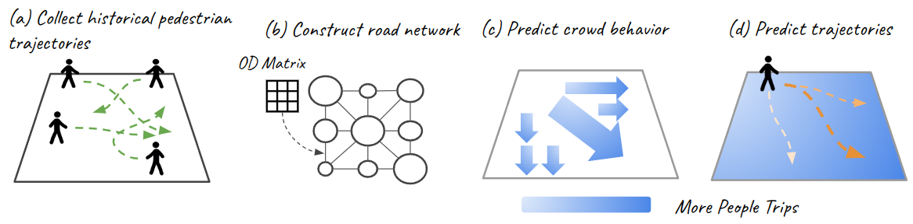
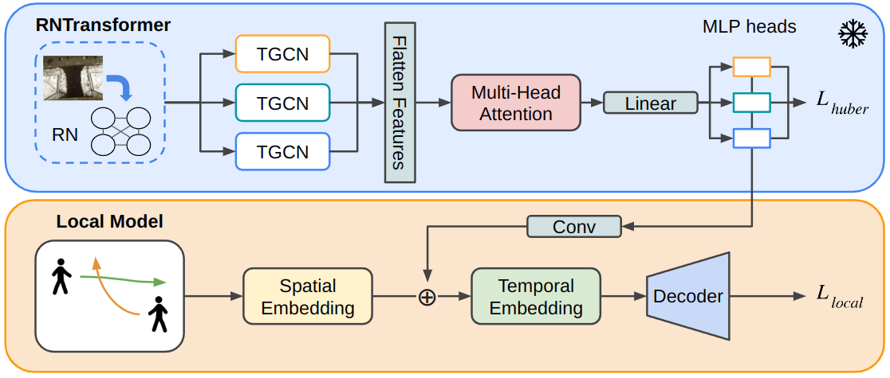
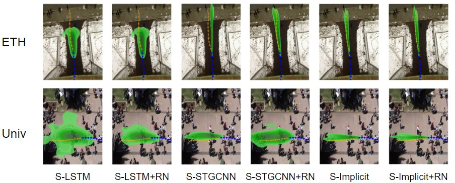
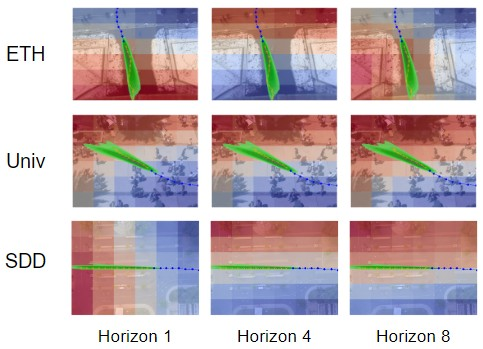

# Enhancing Pedestrian Trajectory Prediction with Crowd Trip Information

[Preprint](https://arxiv.org/abs/2409.15224)

**[Rei Tamaru](https://reitamaru.com), [Pei Li](https://directory.engr.wisc.edu/cee/Staff/Li_Pei/), and Bin Ran**

University of Wisconsin-Madison

<!-- <b>New</b>:  -->

## Incorporating Trip Modality to Trajectory Prediction Models


We propose a novel approach incorporating trip information as a new modality into pedestrian trajectory models. Our proposed RNTransformer, a generic model that utilizes crowd trip information to capture global contextual information about pedestrians, is integrated with various socially aware local pedestrian trajectory prediction models to demonstrate its performance.

With a pretrained RNTransformer in a training process of the pedestrian trajectory prediction model, we achieved 1.3/2.2% improvement on Social-LSTM, 6.5/28.4% improvement on Social-STGCNN, and 8.6/4.3% improvement on S-Implicit in ADE and FDE.

### Model Architecture


### Prediction samples



### Prediction results overlayed of crowd behavior prediction


## Usage

Here is the repository structures. Please add the these directories if needeed.

```bash
├── scripts/
│   └─── ...
├── models/
│   └─── ...
├── utils/
│   └─── ...
├── results/
│   └─── {dataset_name}/
│       │── preprocessed/
|       |   │── train/
|       |   │── test/
|       |   └── val/
│       │── train/
│       │── test/
│       └── val/
├── pretrained/
│   └─── {model_name}/
|       └─── {dataset_name}/
├── logs/
├── runs/
├── train_rn.py
├── test_rn.py
├── run.py
├── test.py
├── requirements.txt
└── .gitignore
  
```

### Prerequisites
We used Ubuntu 22.04 LTS and NVIDIA GeForce RTX3080 for our training and test.


Download datasets from [Google Drive](https://drive.google.com/file/d/1luDe5ZlOZeEmH92Q0XzcmCHXJ8ZLhUoC/view?usp=sharing) or download them from official websites.


### Installation
```
$ git clone https://github.com/raynbowy23/RNTransformer.git
$ cd RNTransformer
$ conda create -n peds python=3.10
$ conda activate peds
$ pip install -r requirements.txt
```

To avoid unexpected error, we recommend to install PyTorch individually (e.g. ```pip install torch==2.0.1```).

### Run

Change the hyperparameters and run RNTransformer first.

``` bash
bash scripts/train_rn.sh
bash scripts/test_rn.sh
```

Then select the best performing pretrained model and similarly run the whole trajectory model.

``` bash
bash scripts/train_peds.sh
bash scripts/test_peds.sh
```

You may change the image folder path to store the visualized results.

### TODO

- [x] Upload a paper
- [x] Further model training on the [Stanford Drone Dataset](https://cvgl.stanford.edu/projects/uav_data/).
